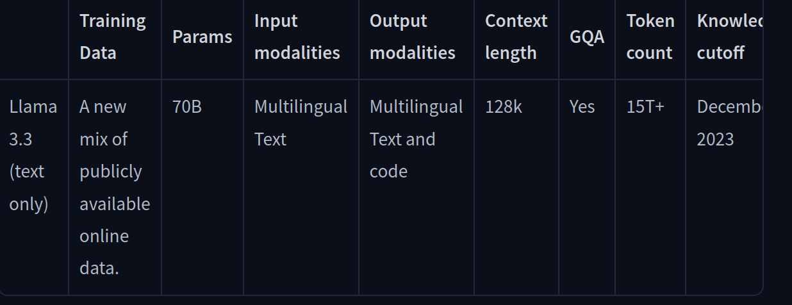

# Practice ai LLM's

## Name

AI Practice

## Description

The idea for this is to practice, what the different components of LLM based AI are. At the end we will build a small application that encompasses most of the basic principles.

## Part 0, Setup

We are using Python as our programming base, so the initial setup is very similar to any other Python program.

1. Start a new project in VS Code.
2. Create an environment:
    - `python3 -m venv .venv`
    - The environment may also be created with Vs Code pressing F1 and selecting create new environment.
3. Activate the environment
    - `. .venv/bin/activate`
    - The environment may also be activated using Vs Code pressing F1
4. Create a rquirements file to contain the libraries that are needed.
    - requirements.txt
    - wheel
    - openai
    - ollama
    - groq
5. Install the libraries:
    - `pip install -r requirements.txt`
6. Create .env file with API keys
    - for safety reasons not added to project. 
    - for the project you need a Groq API key and an OpenAI api key

## Part I, Chat

The most basic usage of an LLM is to chat. Ask a question and obtain an answer.
LLM's have been trained on a large base of textual information. The text has been converted to tokens (groups of characteres) through a method called embedding.

When asked a question ("prompt"), the LLM converts the prompt to embeddings and then generates a response based on the values of those embeddings, through a "similarity test" method. In general, the result is valid, but since the LLM has been trained on millions of parameters, this similarity test may produce unexpected results or "hallucinations".

It is very important to formulate the prompt in such a way that it is less easy for the LLM to generate "hallucinations". Therefore, the request must be concise, clearly stated, easy to understand.

1. Create a loop to ask a question and get an answer.
2. Setup different LLM's: OpenAi, Groq, Ollama

## Part II, Conversation and context

One alternative to reduce the possibility of "hallucinations" is to provide context. The basic idea is to add more background iformation to the "prompt".

The term "prompt engineering" is derived from the fact that good prompts generate good results, and bad prompts generate bad results.

The other option that helps in generating better results from the LLM is the concept of conversation. In this case, the context is provided interactively by the user by making more precise request with each interaction. The idea here is that by maintaining the conversation, the LLM has more data on which to base its next response.

There are some limits to these strategies, however. Mainly the number of tokens that the LLM can take at a time:

In this case Context Length is the amount of data that the model can take at a time as context.

In this section we are going to use Streamlit to create a web page where we will have our conversation. There is an input area and the output area. Every time there is a new input, this gets added to the conversation and sent to the llm, therefore maintaining the conversation. The output will include all the conversation up to this moment.

To run the streamlit application:

`pip install -r requirements.txt`

## Part III, Conversation and context

In the first lesson we are going to build a RAG (Retrieval Augmented Generation) system that will take information from a book, save this information in a vector database and then use the llm to answer questions about the book.

The concepts involved are:
Documents: Read documents
Embeddings: Create embeddings
Vector database: Save embeddings in Vector Database
Retrieve: Embed prompt, and retrieve relevant parts of document.
Generation: Improve LLM response by including the prompt and the retrieved documents.

For the purpose of this lesson, we are using Llamaindex which is a development environment that has functions for the different steps involved in RAG and other LLM related functions.

For the second part, we are going to create two scripts:

part_3_2a.py: This script will take care of the document encoding. The document will be saved in a local reporistory, just like in the first lesson, but if the repository is already created, it will not be created again.

part_3_2b.py: This script will take care of the retrieval part. We will create a streamlit application that will allow the user to question the LLM with respect to the document.

## Part IV, React Agent
